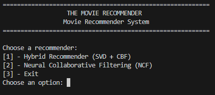
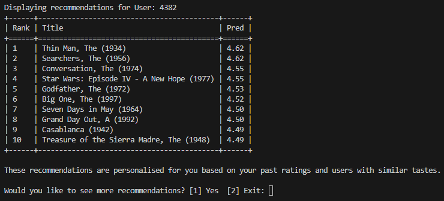
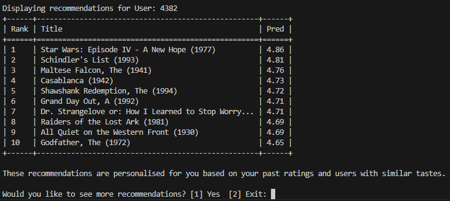

# Movie Recommender Systems: Hybrid Filtering vs Neural Collaborative Filtering

### Overview

This project implements and evaluates two movie recommendation systems using a 100,000-rating sample drawn from the MovieLens 1M dataset.

The objective is to compare a traditional recommendation approach against a neural-network-based recommender while providing an interactive recommendation experience through a command-line interface.

The project includes:

* Hybrid Recommender System (Matrix Factorisation + Content-Based Filtering)
* Neural Collaborative Filtering (NCF)
* Shared evaluation pipeline
* Pretrained model artefacts for immediate execution
* Interactive CLI for generating personalised movie recommendations

---

### Recommendation Systems

#### 1. Hybrid Recommender (Matrix Factorisation + Content-Based Filtering)

The hybrid system combines:

* Collaborative Filtering using biased Matrix Factorisation trained with stochastic gradient descent
* Content-Based Filtering using movie genre information

The collaborative component captures user-item interaction patterns, while the genre-based component provides an additional signal for sparse and low-support items.

#### 2. Neural Collaborative Filtering (NCF)

The neural recommender uses:

* User embeddings
* Movie embeddings
* User demographic features
* Movie genre features

The NCF-style model performs explicit-rating regression, augmenting learned user and movie embeddings with user demographic and movie genre features. A neural network models non-linear interactions between these representations to predict ratings.

---

### Dataset

This project uses MovieLens 1M as its source dataset.

MovieLens is a widely used benchmark dataset for recommender systems research and contains:

* 1 million movie ratings
* Approximately 6,000 users
* Approximately 4,000 movies

The experiments use a deterministic, activity-weighted sample of 100,000 ratings drawn from MovieLens 1M. Both recommenders use the same preprocessed sample and held-out evaluation data to enable a consistent comparison.

The dataset is not included in this repository.

To retrain the models from scratch, place the following files inside the `data/` directory:

```text
data/
├── movies.dat
├── ratings.dat
└── users.dat
```

Dataset source:
https://www.kaggle.com/datasets/odedgolden/movielens-1m-dataset

---

### Included Model Artefacts

Pretrained model artefacts are included in the repository.

This means the recommendation systems can be executed immediately without:

* Downloading MovieLens
* Rebuilding preprocessing pipelines
* Retraining models

The repository loads saved artefacts from the `models/` directory during startup.

To retrain from scratch, remove the contents of `models/` and provide the MovieLens dataset in the `data/` directory.

---

### Installation

Install dependencies:

```bash
pip install -r requirements.txt
```

---

## Running the Project

Launch the application:

```bash
python main.py
```

The application provides a menu allowing you to choose between:

1. Hybrid Recommender (Matrix Factorisation + Content-Based Filtering)
2. Neural Collaborative Filtering (NCF)

You can:

* Select a specific user ID
* Generate recommendations for a random user
* Browse recommendation results through the CLI

---

### Evaluation

Both recommenders are evaluated on the same held-out test split of 32,535 ratings.

The evaluation uses:

* **RMSE** — measures rating-prediction error (lower is better)
* **Serendipity@10** — an offline proxy for relevant recommendations that differ from a user's established genre profile (higher is better)

Run the evaluation pipeline:

```bash
python -m src.evaluation.run_eval
```

| Model           |     RMSE ↓ | Serendipity@10 ↑ |
| --------------- | ---------: | ---------------: |
| Hybrid MF + CBF |     1.0087 |           0.5082 |
| NCF             | **0.9971** |       **0.5135** |

The NCF model achieved slightly lower rating-prediction error and slightly higher serendipity than the hybrid approach. The relatively small differences suggest that both approaches perform comparably under this evaluation setup.

Serendipity@10 is calculated as an offline proxy using relevant held-out items and their genre dissimilarity from each user's training-history profile.

---

### Technologies Used

* Python
* NumPy
* Pandas
* PyTorch
* MovieLens 1M Dataset
* Matrix Factorisation
* Content-Based Filtering
* Neural Collaborative Filtering

---

### Demo Screenshots

#### Main Menu



#### Hybrid Recommendations



#### NCF Recommendations


